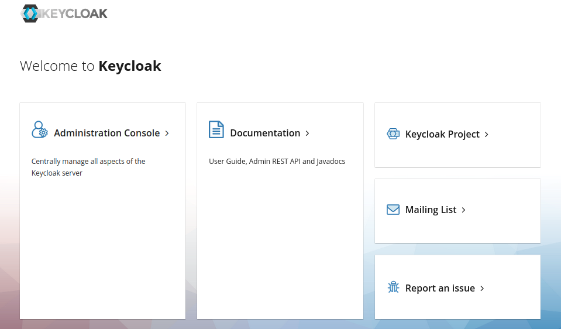
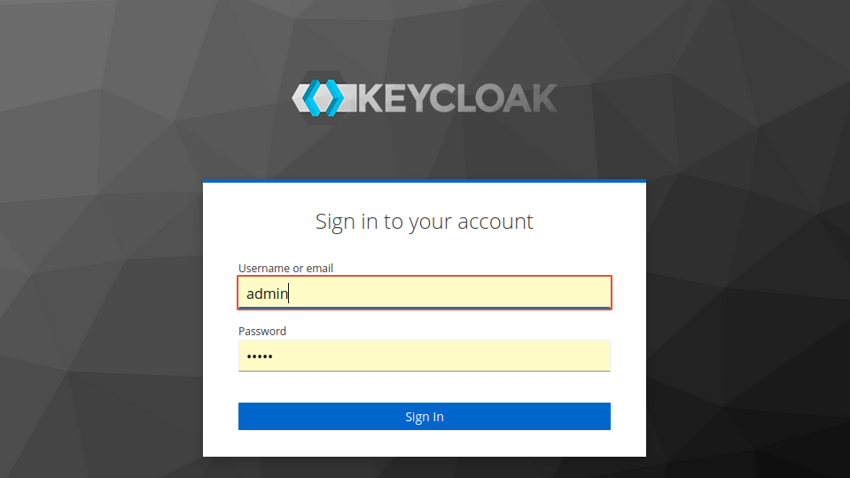
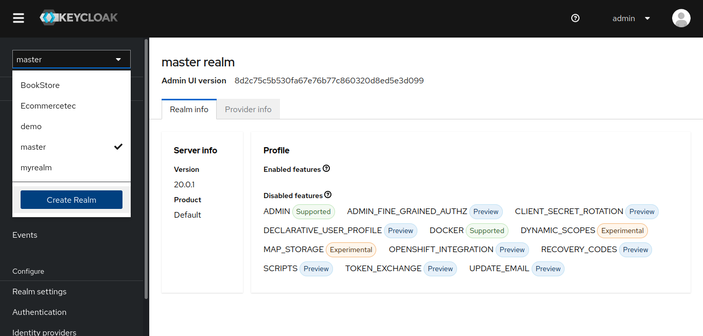
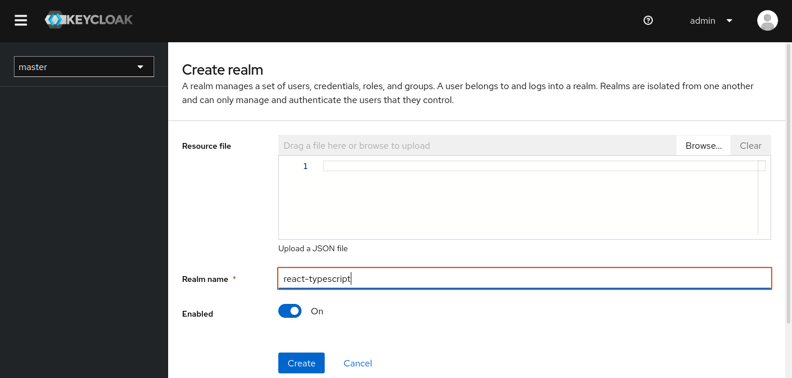
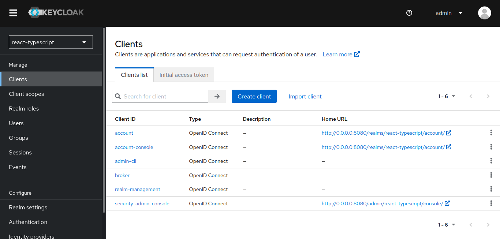
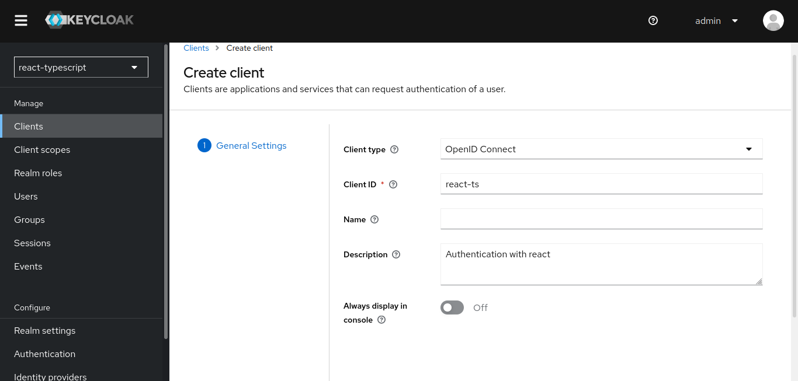
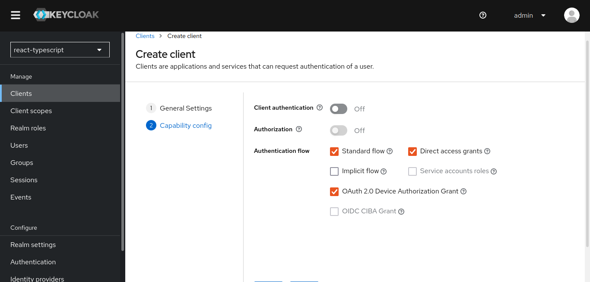
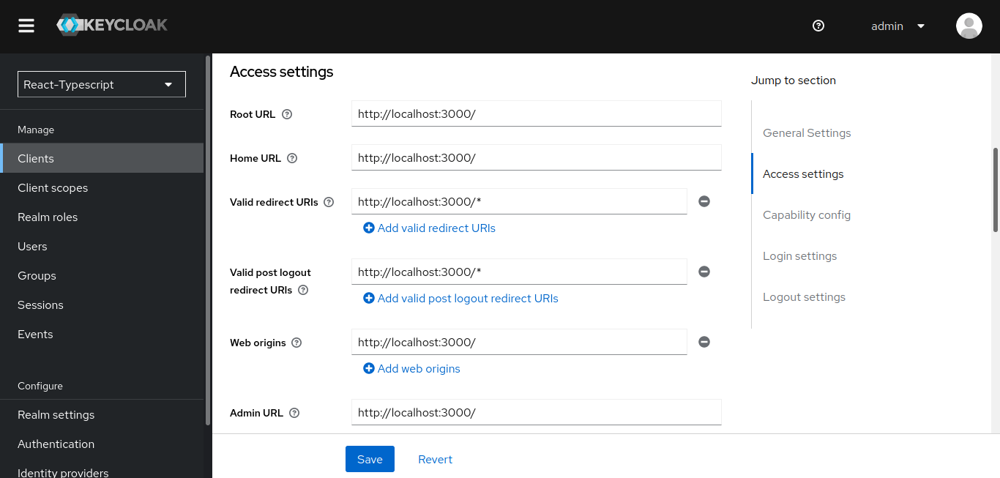
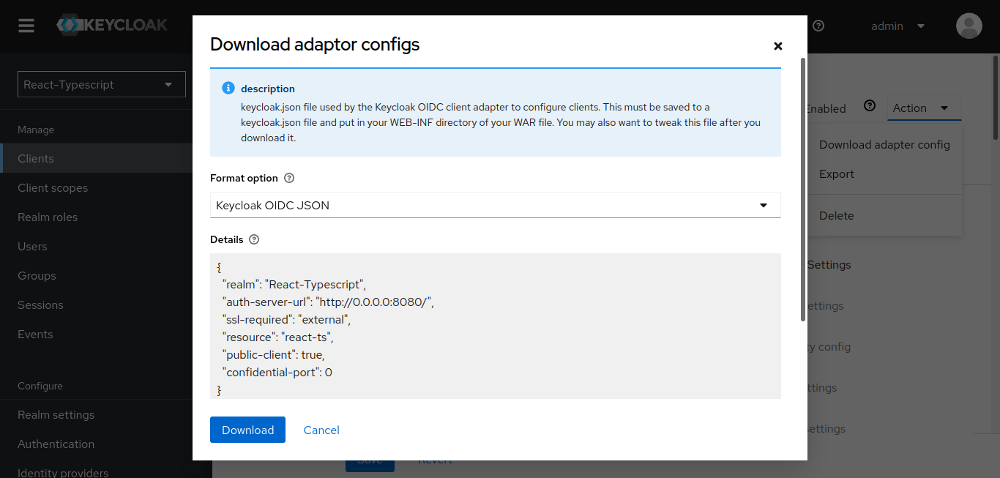
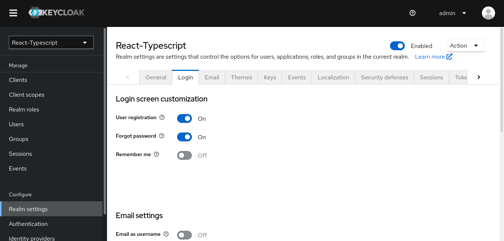

# <p align='center'>  React with typescript and keycloak </p>

<p align='center'> 
This is a mini login authentication system, using keycloak.
</p>

## Summary

* [Installing Keycloak in Docker](#installing-keycloak-in-docker)
* [Configuring the Keycloak](#configuring-the-keycloak)
* [Integrating Keycloak in React](#integrating-keycloak-in-react)
* [Installing Dependency](#installing-dependency)
* [Technology used](#technology-used)


## Installing Keycloak in Docker

```bash
# Run this command in cmd
docker run -p 8080:8080 -e KEYCLOAK_ADMIN=admin -e KEYCLOAK_ADMIN_PASSWORD=admin quay.io/keycloak/keycloak:20.0.2 start-dev
```
[Docker](https://www.keycloak.org/getting-started/getting-started-docker)

Running keycloak
```bash
docker start [container name]
```
Access the url
```bash
http://0.0.0.0:8080/admin/master/console/
```

## Configuring the Keycloak

 - Step 1
   - Administration Console

   

 - Step 2
   - username: admin | password: admin

   

- Step 3
  - Create a realm

  
  

- Step 4
  - Create a client and select OAuth 2.0 
  
  
  
  
  

- Step 5
  - Access settings

  

- Step 6
  - Download adaptor configs

  
    
- Step 7
  - Login screen customization
    

## Integrating Keycloak in React

Change keycloak **json** file to **ts**

```json
// file Json
{
  "realm": "React-Typescript",
  "auth-server-url": "http://0.0.0.0:8080/",
  "ssl-required": "external",
  "resource": "react-ts",
  "public-client": true,
  "confidential-port": 0
}
```

```ts
// file Ts
import Keycloak from "keycloak-js";

const keycloakConfig = {
  realm: "React-Typescript",
  url: "http://0.0.0.0:8080/",
  clientId: "react-ts",
};

const keycloak = new Keycloak(keycloakConfig);

export default keycloak;
```

## Installing Dependency

```react
    npm install
```

```react
    npm install --save @react-keycloak/web
```

## Technology used

|[Typescript](https://developer.mozilla.org/pt-BR/docs/Web/TypeScript)|[Docker](https://www.docker.com/products/docker-desktop/)|
|--- | ---|
|[Keycloak](https://www.keycloak.org/)|[CSS](https://developer.mozilla.org/pt-BR/docs/Web/CSS)|
|[HTML](https://developer.mozilla.org/pt-BR/docs/Web/HTML)|[Node](https://nodejs.org/en/)|
|[Vs code](https://code.visualstudio.com/download)|[Reactjs](https://reactjs.org/docs/create-a-new-react-app.html)|


#
###### Author : Aniceto Jolela 🥰
 My  | [Linkedin](https://www.linkedin.com/in/aniceto-jolela-076547184/))
